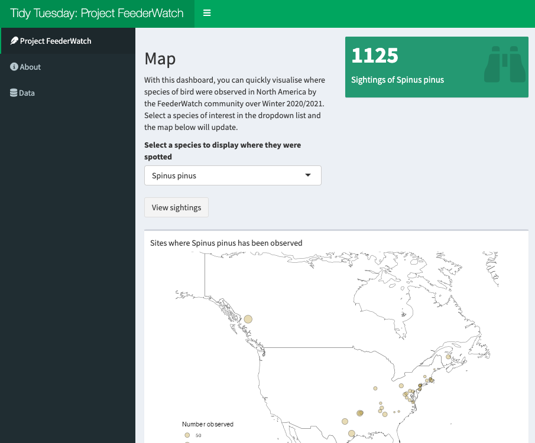

# Styling a Shiny App

R Shiny is a fantastic tool for creating beautiful, interactive web apps. One of the most powerful features of Shiny is how easy it is to create functional apps, even if you’re new to the package. On the flip side, styling can be tricky and as a developer, you don’t just want to produce apps that work, but also stunning UIs that enhance the user experience.

There are a range of approaches to styling Shiny apps so when you’re early in your Shiny journey, it can get a bit overwhelming trying to choose the best approach for your app (and that’s without even thinking about CSS!). The syntax for each approach varies, the documentation isn’t necessarily easy to follow, you don’t really know what the result might look like and it can be tough finding examples of code to help your understanding. And then on top of all those concerns, it can also be intimidating to experiment with another new tool as you find your feet with Shiny because you don’t want to break anything!

As with anything, the best way to learn is by experimenting but this guide and its associated repo are here to help you understand some of the different approaches available so you can create beautiful, functional apps sooner rather than later.

We’ll explore three popular approaches to styling Shiny apps:

* bslib
* shinydashboard
* shiny.semantic
* Update: `Sass` (I've updated this guide with a new section on Sass right at the end!)

*Make sure you have these packages installed to follow along and run the apps in the repo. The apps for each framework live in folders named after the framework. It may make it easier to understand what is happening by comparing scripts side-by-side and even doing your own little experiments on the code.*

But before we look at how these packages work, we need to build a template app in base Shiny, which you can find the script for in the base Shiny folder. We'll use this template to then create new apps with the other frameworks.

<br>

<hr>

## Building an app
### Data
For the app, we use the Tidy Tuesday dataset on [Project FeederWatch from Week 2 of 2023](<https://github.com/rfordatascience/tidytuesday/blob/master/data/2023/2023-01-10/readme.md>). In short, the data describe the distribution and abundance of bird species across North America over winter 2020/2021 so with this dataset, we can create a simple dashboard that visualises where a selected species has been observed in North America.

In the app script between lines 13 (with the heading "load data") and 90 (with the heading "function to plot species' location"), we're just doing a bit of prep work to clean the data and create a function to produce the map to visualise the distribution and abundance of a given species. (It's fairly straightforward and the comments should help guide you to understanding what's happening.)

### App function
For the purposes of exploring the styling capabilities available in Shiny, we add a little bit of complexity to our app by having three tabs: one to perform the app's main function (the visualisation), one to serve as an about section and one to simply display all the data in a table.

### UI
In the first tab, we want to give the user the ability to select a species from the data and we want a plot to visualise the data requested so we need an input for users to select a species of interest and a plot output for the map produced by `plot_species()`.

In the about tab, we simply have some text describing Project FeederWatch making use of HTML tags. And, for our data tab, we have a data table displaying all the cleaned data.

### Server
A brief overview of what's happening in the server:

* in line 151, we are getting the data of the species selected by the user
* line 155 and line 159, creating a title for the graph with the selected species' name
* line 163 and line 167, creating the map
* line 171, creating a table of the data for the selected species
* line 178, calculating the number of times the selected species was observed (we don't actually use this output in the base Shiny app but it will become useful in the ones we create later)

There's nothing super fancy happening here, we're mainly using `eventReactive()` with a button in the UI triggering when we update the app so our computed outputs don't constantly update as the user plays around with the `selectInput()` element.

The server remains the same for all the approaches we explore here so from here on, our focus will solely be on the UI.

<br>

<hr>

## Base app
With the UI and server sorted, let's see how the app looks (you can also run the app.R script in the base Shiny folder to see how it works). Using base Shiny, we have a pretty basic app that gets the job done and while it's not ugly, it could certainly look more enticing.


<br>

<hr>

## Layout
There are two sides to styling our apps, one is the layout (think the overall structure) and the other is theming (think colour schemes and finer details) I generally think it is easier to start the styling process by focussing on the layout before jumping into theming.

In base Shiny, we made an app with three tabs with one of those tabs having a sidebar layout. We'll look at how to replicate this in `bslib`, `shinydashboard` and `shiny.semantic`. Although we aren't directly addressing theming here, you'll see how each framework has its own aesthetic giving the app a different feel.

<br>

### `bslib`
As we'll see with the other frameworks, the structure of a `bslib` app is slightly different to that of a base Shiny app. It takes a bit of work to translate the app from one framework to another but, by and large, there are equivalent functions so the process just requires a bit of attention to detail.

The `bslib` app itself looks a lot like the base Shiny app but more nicely organised, particularly with respect to the header and the spacing between elements.


<br>

Let's have a look at how the code changes. 
<br>

#### `page_navbar()` and Tabs
To create our tabs, we no longer define them in `tabsetPanel()` or an equivalent. Instead, we replace `fluidPage()` with `page_navbar()` and then wrap the contents of each tab in `nav_panel()`.`nav_panel()` is  `bslib`'s version of `tabPanel()` so that is a straight swap.

Wrapped inside `page_navbar()`, we no longer have `titlePanel()` but simply `title = "Tidy Tuesday: Project FeederWatch"`. Make sure you make this change otherwise your app will break!
<br>

#### Sidebar layout
The code for our sidebar layout in the Project FeederWatch tab also requires a few substitutions. We swap `sidebarLayout()` with `layout_sidebar()` to wrap the contents of the tab. 

`layout_sidebar()` works a bit differently to `sidebarLayout()`. We now define the sidebar with `sidebar = sidebar()` rather than simply `sidebarPanel()` and we don't specify `mainPanel()`; the contents of the main panel is simply taken as arguments that follow `sidebar = sidebar()`.
<br>

#### Fine Tuning
A nice feature of `bslib` is the value box, which can be an eye-catching way of communicating a result. In the Project FeederWatch tab, we've added a value box that sits in the sidebar and lines 200-215 in the server to give it its reactive content.

`bslib` gives us access to Bootstrap's cards, which essentially act as containers that we can use to better organise our apps. While our app doesn't make use of all the nifty features available to us with cards, we do use the `full_screen` option. This is particularly useful in this case where we have a map that would benefit from a bigger canvas to fully showcase the data.

You may have noticed `fillable = F` wrapped inside `page_navbar()`. This argument tells Shiny that we don't want our outputs to change in size as the user resizes the window. By doing so, we prevent our outputs from being cut off or shrunk.

<br>

### `shinydashboard`
`shinydashboard` is a fair bit different to base Shiny. As you'll see below, if you want a sidebar in your app, it'll be there on every tab and because of this feature, having your user inputs in the sidebar only makes sense if they are applicable to all tabs. Due to this constraint, the sidebar is better suited to arranging tabs in our case.

Although the app we get looks more complete than the base Shiny one, it's boxy and not particularly pretty...


<br>

#### `dashboardPage()`
To create our dashboard in `shinydashboard`, we use `dashboardPage()` in a straightforward swap for `fluidPage()`. After `dashboardPage()`, there are three important functions for defining the layout under the `shinydashboard` framework:

* `dashboardHeader()`
* `dashboardSidebar()`
* `dashboardBody()`
<br>

#### Header
`dashboardHeader()` serves a similar function to `titlePanel()`; we use it to define the title of the app. We also have the option to increase the width of the title's section in the header with the `titleWidth` parameter. This will be pertinent if you have a long title.
<br>

#### Sidebar
As mentioned earlier, the sidebar in the `shinydashboard` app is present on all pages so it works better as a menu, which we can do using the `sidebarMenu()` function coupled with `menuItem()`.

We provide `menuItem()` with a label for the tab to display, an identifier for the tab, which we use in the body, and optionally, we can provide an icon to display alongside the label.
<br>

#### Body
`dashboardBody()` is where the main contents of the app lie. To create tabs, we use `tabItems()` and `tabItem()`. `tabItem()` wraps the code for each tab while `tabItems()` wraps around all the tabs.

`tabItem()` works more or less like `tabPanel()` so we just wrap the contents of our tab in the function. The one important thing to remember is that the `tabName` argument must match one of the `tabName` arguments defined in `menuItem()`.

In the case of our app, as it wouldn't make sense to ask the user for inputs in the sidebar, the input element and the button have been moved into the body using `fluidRow()` to define where we would like to place them.
<br>

#### Fine Tuning
Like `bslib`, `shinydashboard` has a value box feature. Unlike `bslib` though, `shinydashboard` treats the whole value box as a dynamic element so we render the value box in the server rather than just the specific parts we want to update as the user interacts with our app (see lines 200-215). And, we have an output function specific to the value box in `valueBoxOutput()`.

Similarly, we have boxes, which are equivalent to `bslib`'s cards and can be used as containers. Boxes can be useful for ensuring there is some padding between elements but they don't always do what you want. For example, the height of the box cannot be changed to display more of the data table output in the FeederWatch tab.

<br>

### `shiny.semantic`
The final approach we'll explore works under a very different framework to `bslib` and `shinydashboard`. As its name suggests, `shiny.semantic` uses Semantic-UI (or rather Fomantic-UI) instead of Bootstrap. There's not really too much to worry about with respect to what that means for how we create our UI in R; the code just follows a different style.

Under the Semantic framework, we get a very clean looking UI with quite a modern feel but it's little bare looking.


<br>

#### `fluidPage()` and Elements
As with the other frameworks, `shiny.semantic` has its own version of base Shiny's `fluidPage()`: `semanticPage()`. And, as with base Shiny, we use `titlePanel()` to give us a title panel.

One of the great features of `shiny.semantic` is that the names of the functions for elements are the same as base Shiny's so if you want to see what your app looks like with a Semantic-UI engine, you don't need to change every single element. They are simply rendered as Semantic style elements. One distinction to note is that under `shiny.semantic`, `selectInput()` does not have a `selectize` parameter so user may have to scroll through all options in our app to find a species of interest.
<br>

#### Tabs
Creating tabs in `shiny.semantic` can get a little messy compared to the other approaches. We use the function `tabset()` to create tabs. It takes as its main argument `tabs`, which must be given as a list wrapping a set of lists. Each list in this set defines the contents of a tab. This is illustrated in line 99 where we have `tabs = list(` followed in the next line by `list(menu = "Project FeederWatch",`. The lists used to define the contents of a tab (e.g. the list spanning lines 100-131) have three arguments:

1) `menu` - gives the tab its name (this is the equivalent to `titlePanel()`'s `title` parameter)
2) `content` - defines the content of the tab. If you have more than one element in your tab, which you most likely will, it is important that you wrap all the content in a `div()` tag
3) `id` - an ID for the tab

`tabset()` has an optional parameter: `menu_class`, which we can use to change the appearance of the tabs.
<br>

#### Sidebar
A sidebar layout is simply created using `sidebar_layout()`, `sidebar_panel()` and `main_panel()`. It's a straight swap for base Shiny's camel case equivalents. The only thing to note is that Semantic-UI has 16 columns as opposed to Bootstrap's 12.
<br>

#### Fine Tuning
A nice benefit of `shiny.semantic` is its class system, which tends to be simpler and more intuitive than Bootstrap's. As an example, we use `class = "ui basic segment"` to define the type of segment we would like the content of our tabs to sit in. With the Semantic classes we can quite quickly experiment with the look of our apps. Sadly, the class system can't do everything so you may need to dabble in some CSS to get things looking exactly as you want it. For example, it'd be nice to remove the borders surrounding the content in the tabs.

Another `shiny.semantic` feature to be aware of is `semantic_DT()`, which generates a DT table in the Semantic style. It sits in the server inside `renderDataTable()` and takes a data frame as an argument. (Note that in the UI, we consequently use `semantic_DTOutput()` instead of `DT::dataTableOutput()`)

<br>

<hr>

## Theming
Now that we've got the layout side of styling our Shiny apps sorted, we'll explore the theming tools available in the three frameworks.

<br>

### `bslib`
Theming in `bslib` is extremely straightforward to do. You can create a dashboard with quite a bespoke, professional feel very quickly.


<br>

#### `bs_theme()`
The `bs_theme()` function does most of the heavy lifting for you. All we need to do is provide values for the properties we want to change, e.g. background colour, `bg`, and set the value of `page_navbar()`'s theme argument as `bs_theme()`, i.e. `theme = bs_theme()`.
<br>

#### `thematic_shiny()`
The one downside to `bs_theme()` is that plotOutputs are unaffected so they can look out of place. Fortunately, the `thematic` package implements another easy-to-use solution in `thematic_shiny()`, which grabs the CSS styles surrounding plots and applies them to the plots (Note: it works for `ggplot2`, `base` and `lattice` visualisations). We call the function outside the UI, and in a similar way to `bs_theme()`, we just provide values for the properties we want to change. And, to make our lives even easier, we can set some of the parameters to `"auto"` so that the plot's theme inherits the theming we specify in `bs_theme()`.
<br>

#### Fine tuning
With a few lines of code, our `bslib` app is almost complete. It's a small detail but we have a rounded border surrounding the content in the Project FeederWatch tab but not the other two. We can add one with a bit of CSS using `nav_panel()`'s class argument, as in line 144. You can compare how this looks by running the app and checking it against the images above.

<br>

### `shinydashboard`
Theming with `shinydashboard` is limited. We really only have one option to play with and that's the `skin` parameter of `dashboardPage()`. It defaults to blue (as we saw above) and only takes a handful of named colours without CSS, it isn't really possible to create something bespoke or aesthetically pleasing.



<br>

### `shiny.semantic`
Again, theming here is limited. It's very much reliant on using classes, for example, in line 113, where we give the action button the `"ui primary button"` class so it takes on the primary colour. Semantic has a default set of named colours, which you can change using a CSS file in which you define those named colours.

Although we're not exploring how CSS can be used to style Shiny apps here, the overall appearance of a `shiny.semantic` app, even without colour, is nice and clean.


<br>

<hr>

## Wrapping up
And, just like that, we've created a Shiny app and explored how it can be themed under three different frameworks! It can be hard to learn Shiny without having some templates that show how everything fits together so, hopefully, this guide has helped you understand how we can style apps and, particularly, if you're still fairly new to Shiny, shown you it's not necessarily as tricky or intimidating as it might seem.

<br>

<hr>

## Update: Sass
Once you've gotten to grips with `bslib`, `shinydashboard` and/or `shiny.semantic`, you may want to try your hand at using CSS (even with all the headaches it can bring) to have greater control over how the app looks and feels. Rather than using CSS, we'll actually be using the popular pre-processor Sass, which is ultimately compiled into CSS, but has a few advantages for us with its biggest benefit being that we can simplify our style sheets.

I won't go into too much detail on how Sass works so I highly recommend having a scan over the [basics](<https://sass-lang.com/guide/>) if you aren't familiar with it. This is more of a beginner's guide to getting started with Sass in Shiny.

We'll use the `shiny.semantic` app we created a little earlier because it is ready to be themed and we'll try to make it look more like the `bslib` app.

### Set up
Before we begin, you'll need to install the `sass` package, which contains functions to compile Sass into CSS and read in our style sheet. Getting our app ready to use Sass is very straightforward:

1. Create an `scss` file (note: there's a difference between `sass` and `scss` files!)
2. Save it
3. Process it into CSS for Shiny using (line 96 in the `app.R` file):
```{r eval=FALSE}
css <- sass(sass_file("file_name"))
```

4. Tell our app to use this CSS by placing it in the head of our app (line 119):
```{r eval=FALSE}
tags$head(tags$style(css))
```


### Variables
Taking advantage of Sass' variables feature, we define our colour scheme in lines 1-6 (of the `scss` file). Variables simply have to start with `$` and we can name them anything we like; in this case, I have named them according to the parameters we used in `bslib` so that it helps us map the theme over.

### Styling Elements
Styling our elements using Sass is pretty straightforward. As with CSS, we declare the selector followed by curly braces and attributes we want to change with values. The difference with Sass is that we can use our declared variables in place of values, for example:
```{scss eval=FALSE}
body {
  color: $fg;
}
```

It really is as simple as that and very quickly we can get our app looking much nicer!


### Finding Selectors
The tricky part of Sass is knowing which selectors to use, particularly if you are new to styling with CSS/Sass. But, we can find the selectors by right-clicking on an element and inspecting it. For example, if we wanted to change the appearance of the tabs, we just inspect the element and we can now find the classes that apply to the tab elements on the far right:


And, with the inspector, we can even play around with properties of elements to test new looks without having to constantly reload the app:


### `shiny.semantic`
`shiny.semantic` works really nicely when you want to style your app with Sass because you can declare classes for many elements and they are straightforward names but there are a few points to note when using it. 

#### `sidebar_layout()`
`sidebar_layout()` quickly creates a sidebar and a main panel without having to fiddle around with the grid system that powers it but the two panels it creates and the grid housing the panels are given randomly generated ids so we can't use selectors in our `scss` files to style them. Instead, we have to use the `container_style` and `area_styles` arguments of `sidebar_layout()`. Consequently, we need to write the CSS as though it were inline CSS, which you can do within the `app.R` file and assign to a value (as done in lines 99-114). The values are then supplied to `container_style` and `area_styles`.

#### `titlePanel()`
`titlePanel()` creates the title of our app and gives it an `h2` class, which means that if you want to change the appearance of the title, you will end up changing all of your h2 headings. To avoid this, you need to wrap the content of `titlePanel()` in `div()` and pass an `id` argument to give the title a unique identifier (line 121).
